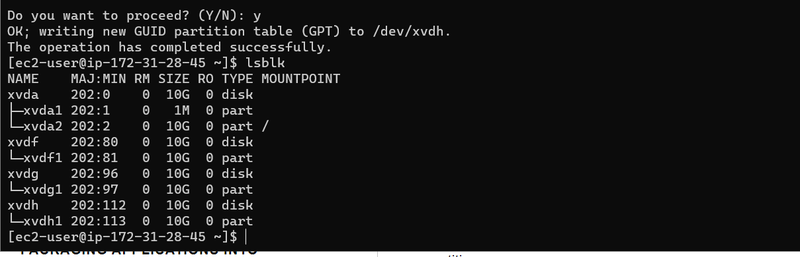
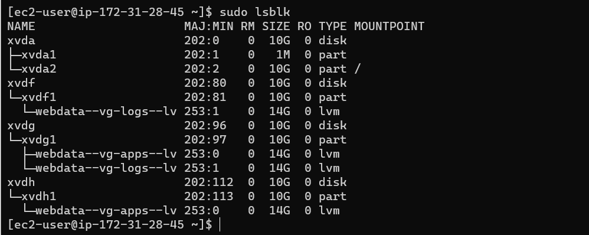
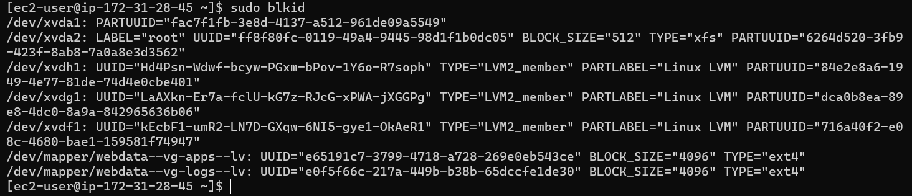
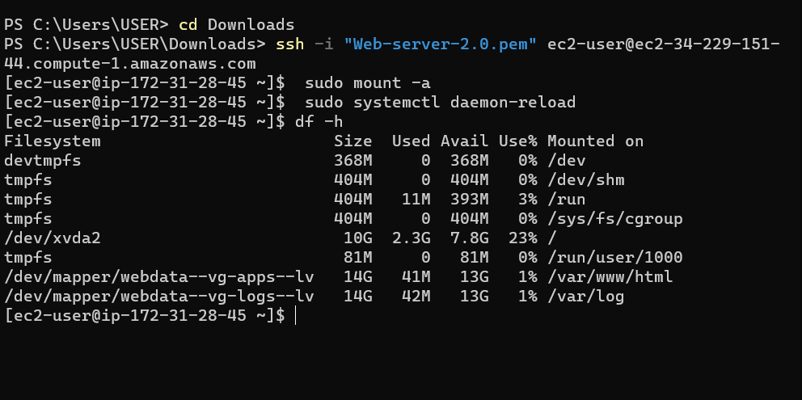
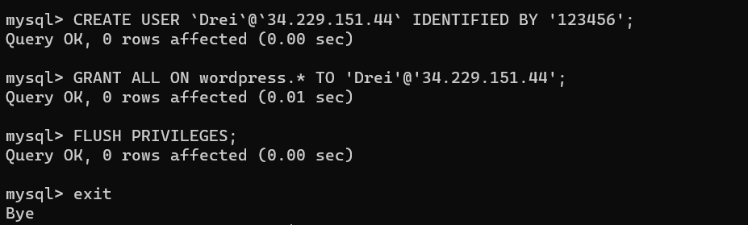
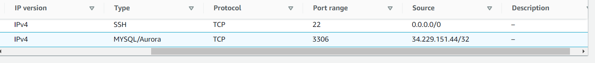
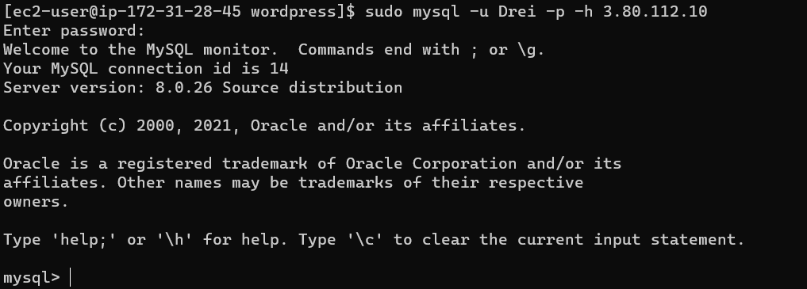
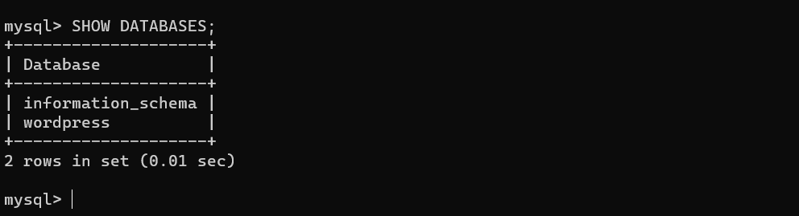
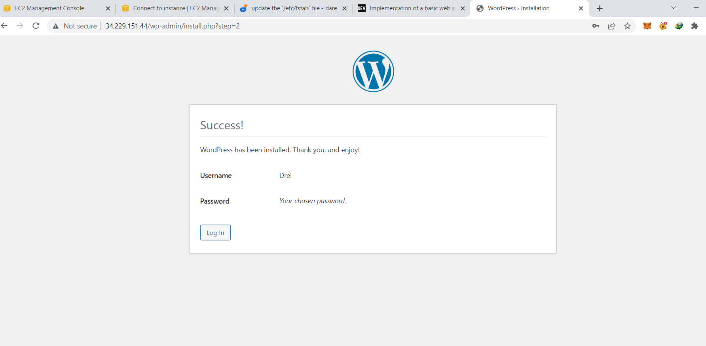
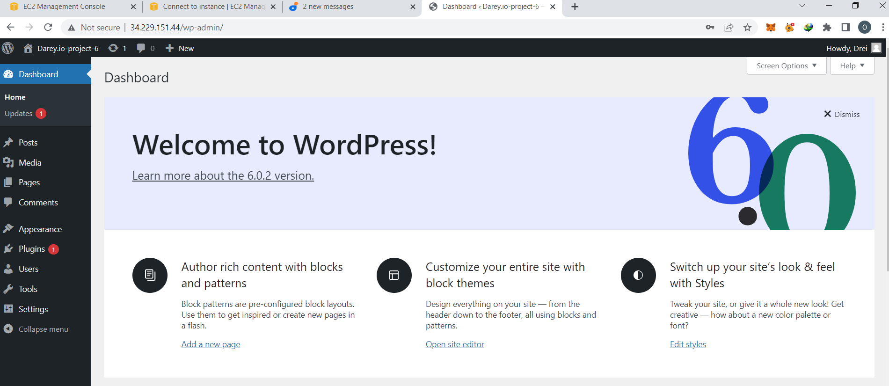

# LAUNCH AN EC2 INSTANCE THAT WILL SERVE AS “WEB SERVER”

## Step 1

Prepare a Web Server

`sudo gdisk /dev/xvdf`

`lsblk `

`sudo vgcreate webdata-vg /dev/xvdh1 /dev/xvdg1 /dev/xvdf1`

`sudo lsblk`

`sudo blkid`

`df -h`

## Step 2

Prepare the Database Server

Launch a second RedHat EC2 instance that will have a role – ‘DB Server’
Repeat the same steps as for the Web Server, but instead of apps-lv create db-lv and mount it to /db directory instead of /var/www/html/.

## Step 3

Install WordPress on your Web Server EC2

`sudo yum -y update`

`sudo yum -y install wget httpd php php-mysqlnd php-fpm php-json`

## Step 4

Install MySQL on your DB Server EC2

`sudo yum update`

`sudo yum install mysql-server`

## Step 5 

Configure DB to work with WordPress

`sudo mysql`

`CREATE DATABASE wordpress;`

`CREATE USER``myuser`@`<Web-Server-Private-IP-Address>` IDENTIFIED BY 'mypass';`

`GRANT ALL ON wordpress.* TO 'myuser'@'<Web-Server-Private-IP-Address>';`

`FLUSH PRIVILEGES;`

`SHOW DATABASES;`

`exit`

## Step 6 

Configure WordPress to connect to remote database

MySQL port 3306 on DB Server EC2. For extra security, DB server ONLY accessible from my Web Server’s IP address.

`sudo yum install mysql`

`sudo mysql -u admin -p -h <DB-Server-Private-IP-address>`

`SHOW DATABASES;`

`http://<Web-Server-Public-IP-Address>/wordpress/`

